# EKS Project Architectural Explanation

## Project Overview

This project deploys a production-ready Amazon Elastic Kubernetes Service (EKS) cluster on AWS using Terraform Infrastructure as Code (IaC). The architecture includes networking, security, load balancing, and GitOps capabilities through ArgoCD.

## 🏗️ Complete Architecture Diagram with Visual Components

```mermaid
graph TB
    subgraph "🔧 Development & CI/CD"
        DEV[👨‍💻 Developer<br/>Local Development]
        GIT[<img src='https://git-scm.com/images/logos/downloads/Git-Icon-1788C.png' width='20'/> Git<br/>Version Control]
        GITHUB[<img src='https://github.githubassets.com/images/modules/logos_page/GitHub-Mark.png' width='20'/> GitHub<br/>Repository & Actions]
        DOCKER[<img src='https://www.docker.com/wp-content/uploads/2022/03/vertical-logo-monochromatic.png' width='20'/> Docker<br/>Containerization]
        TERRAFORM[<img src='https://www.terraform.io/assets/images/logo-hashicorp-3f10732f.svg' width='20'/> Terraform<br/>Infrastructure as Code]
        HELM[<img src='https://helm.sh/img/helm.svg' width='20'/> Helm<br/>Kubernetes Package Manager]
    end

    subgraph "☁️ AWS Cloud Infrastructure"
        subgraph "🏗️ Infrastructure Layer"
            VPC[🌐 VPC<br/>10.0.0.0/16<br/>Multi-AZ Network]
            IGW[🌍 Internet Gateway<br/>Public Internet Access]
            NATGW[🔄 NAT Gateways<br/>Outbound Internet<br/>2 AZs]
            EIP[📍 Elastic IPs<br/>Static Public IPs]
        end

        subgraph "🎯 Load Balancing"
            ALB[⚖️ Application Load Balancer<br/>HTTP Traffic Distribution<br/>Internet-facing]
        end

        subgraph "🏭 Container Services"
            ECR[📦 Amazon ECR<br/>992878410375.dkr.ecr.ap-south-1.amazonaws.com<br/>Container Registry]
            EKS[☸️ Amazon EKS<br/>Managed Kubernetes<br/>Control Plane]
        end

        subgraph "🔐 Security & Access"
            IAM[🛡️ IAM Roles & Policies<br/>• EKS Cluster Role<br/>• Node Group Role<br/>• ALB Controller Role]
        end
    end

    subgraph "☸️ Kubernetes Cluster (EKS)"
        subgraph "🏠 Availability Zone A"
            NODE_A1[🖥️ Worker Node A1<br/>t3.medium<br/>Your App Pods]
            NODE_A2[🖥️ Worker Node A2<br/>t3.medium<br/>System Pods]
        end

        subgraph "🏠 Availability Zone B"
            NODE_B1[🖥️ Worker Node B1<br/>t3.medium<br/>App Replicas]
            NODE_B2[🖥️ Worker Node B2<br/>t3.medium<br/>LB Controller]
        end

        subgraph "📦 Application Workloads"
            APP_PODS[🚀 Node.js Application<br/>Port: 3000<br/>Replicas: 2-4<br/>Image: code_dev:latest]
            APP_SVC[🔗 Kubernetes Service<br/>Port 80 → 3000<br/>Load Balancing]
            APP_ING[🌐 Ingress Controller<br/>ALB Integration<br/>HTTP Routing]
        end

        subgraph "⚙️ System Components"
            ALB_CTRL[🎛️ AWS LB Controller<br/>Manages ALB<br/>IRSA Enabled]
            COREDNS[🔍 CoreDNS<br/>Cluster DNS<br/>Service Discovery]
            KUBE_PROXY[🔄 Kube-proxy<br/>Network Rules<br/>Traffic Routing]
        end
    end

    subgraph "🌍 External Access"
        USERS[👥 End Users<br/>Web Browser<br/>Mobile Apps]
        INTERNET[🌐 Internet<br/>Public Network]
    end

    %% Development Flow
    DEV -->|Code Commit| GIT
    GIT -->|Push| GITHUB
    GITHUB -->|Trigger| DOCKER
    DOCKER -->|Build Image| ECR

    %% Infrastructure Deployment
    TERRAFORM -->|Deploy| VPC
    TERRAFORM -->|Create| EKS
    TERRAFORM -->|Setup| ALB
    TERRAFORM -->|Configure| IAM

    %% CI/CD Pipeline
    GITHUB -->|GitHub Actions| HELM
    HELM -->|Deploy Charts| EKS
    ECR -->|Pull Images| NODE_A1
    ECR -->|Pull Images| NODE_A2
    ECR -->|Pull Images| NODE_B1
    ECR -->|Pull Images| NODE_B2

    %% Network Flow
    USERS -->|HTTP Requests| INTERNET
    INTERNET -->|Route| IGW
    IGW -->|Forward| ALB
    ALB -->|Distribute| APP_SVC
    APP_SVC -->|Target| APP_PODS

    %% Infrastructure Connections
    VPC -.->|Contains| NODE_A1
    VPC -.->|Contains| NODE_A2
    VPC -.->|Contains| NODE_B1
    VPC -.->|Contains| NODE_B2

    NATGW -->|Outbound| NODE_A1
    NATGW -->|Outbound| NODE_A2
    NATGW -->|Outbound| NODE_B1
    NATGW -->|Outbound| NODE_B2

    EIP -->|Attach| NATGW

    %% Kubernetes Internal
    EKS -.->|Manages| NODE_A1
    EKS -.->|Manages| NODE_B2
    ALB_CTRL -.->|Creates| ALB
    APP_ING -.->|Configures| ALB_CTRL

    %% Styling
    classDef devTools fill:#24292e,stroke:#fff,stroke-width:2px,color:#fff
    classDef awsInfra fill:#FF9900,stroke:#232F3E,stroke-width:2px,color:#fff
    classDef k8sWorkload fill:#326CE5,stroke:#fff,stroke-width:2px,color:#fff
    classDef network fill:#4CAF50,stroke:#fff,stroke-width:2px,color:#fff
    classDef users fill:#9C27B0,stroke:#fff,stroke-width:2px,color:#fff

    class DEV,GIT,GITHUB,DOCKER,TERRAFORM,HELM devTools
    class VPC,IGW,NATGW,EIP,ALB,ECR,EKS,IAM awsInfra
    class NODE_A1,NODE_A2,NODE_B1,NODE_B2,APP_PODS,APP_SVC,APP_ING,ALB_CTRL,COREDNS,KUBE_PROXY k8sWorkload
    class USERS,INTERNET users
```



## 🏗️ Infrastructure Components with Technology Stack

### 🛠️ Technology Stack Overview

| Component | Technology | Purpose | Configuration |
|-----------|------------|---------|---------------|
| **🔧 Development** | | | |
| Version Control | Git + GitHub | Source code management | Repository with branches (main/develop) |
| CI/CD Pipeline | GitHub Actions | Automated build & deploy | Workflow triggers on push/PR |
| Containerization | Docker | Application packaging | Node.js 18 Alpine base image |
| Infrastructure | Terraform | Infrastructure as Code | AWS provider, state management |
| Deployment | Helm Charts | Kubernetes package management | Values files for dev/prod |
| **☁️ AWS Infrastructure** | | | |
| Networking | Amazon VPC | Isolated cloud network | 10.0.0.0/16, Multi-AZ |
| Internet Access | Internet Gateway | Public internet connectivity | Attached to VPC |
| NAT Gateway | AWS NAT Gateway | Outbound internet for private subnets | 2 AZs with Elastic IPs |
| Load Balancer | Application Load Balancer | HTTP traffic distribution | Internet-facing, target type: IP |
| Container Registry | Amazon ECR | Docker image storage | 992878410375.dkr.ecr.ap-south-1.amazonaws.com |
| Kubernetes | Amazon EKS | Managed Kubernetes service | Control plane managed by AWS |
| Security | IAM Roles & Policies | Access control & permissions | IRSA for service accounts |
| **☸️ Kubernetes Workloads** | | | |
| Worker Nodes | EC2 t3.medium | Kubernetes worker nodes | 4 nodes across 2 AZs |
| Application | Node.js + Vite | Your web application | Port 3000, static file serving |
| Service | Kubernetes Service | Internal load balancing | ClusterIP, port 80→3000 |
| Ingress | AWS Load Balancer Controller | External access management | ALB integration |
| DNS | CoreDNS | Cluster DNS resolution | Service discovery |
| Network | Kube-proxy | Network rules & routing | iptables rules management |

### 🔄 CI/CD Pipeline Flow


### 📦 Container Image Details

#### **Your Application Image**
```dockerfile
FROM node:18-alpine
WORKDIR /app
COPY package*.json ./
RUN npm ci --only=production
COPY dist ./dist
RUN npm install -g serve
EXPOSE 3000
CMD ["serve", "-s", "dist", "-l", "3000"]
```

**Image Location**: `992878410375.dkr.ecr.ap-south-1.amazonaws.com/code_dev:latest`
- **Base**: Node.js 18 Alpine Linux
- **Size**: ~150MB (optimized)
- **Runtime**: Serve package for static files
- **Port**: 3000
- **Health Check**: HTTP GET /


## 📊 Node Deployment Details

### EKS Worker Nodes Configuration
- **Instance Type**: t3.medium (2 vCPU, 4 GB RAM)
- **Total Nodes**: 4 nodes (2 per AZ for high availability)
- **Auto Scaling**: Min: 2, Max: 6, Desired: 4
- **AMI**: Amazon EKS optimized Amazon Linux 2
- **Storage**: 20 GB gp3 EBS volumes

### Node Distribution by Availability Zone

#### **Availability Zone A (ap-south-1a)**
- **Public Subnet**: 10.0.1.0/24
  - NAT Gateway A (with Elastic IP)
  - Application Load Balancer (internet-facing)
- **Private Subnet**: 10.0.101.0/24
  - **Node A1**: Hosts your Node.js application pods
  - **Node A2**: Hosts system components and additional app replicas

#### **Availability Zone B (ap-south-1b)**
- **Public Subnet**: 10.0.2.0/24
  - NAT Gateway B (with Elastic IP)
- **Private Subnet**: 10.0.102.0/24
  - **Node B1**: Hosts your Node.js application replicas for high availability
  - **Node B2**: Hosts AWS Load Balancer Controller and system pods

### Pod Distribution Across Nodes

| Node | Availability Zone | Primary Workloads |
|------|------------------|-------------------|
| **Node A1** | ap-south-1a | • Your Node.js App (code-dev namespace)<br/>• CoreDNS replica<br/>• Kube-proxy |
| **Node A2** | ap-south-1a | • Your Node.js App replica<br/>• System pods<br/>• Additional workloads |
| **Node B1** | ap-south-1b | • Your Node.js App replica<br/>• CoreDNS replica<br/>• System components |
| **Node B2** | ap-south-1b | • AWS Load Balancer Controller<br/>• Kube-proxy<br/>• System pods |

### Container Images and Registries

#### **Your Application**
- **Image**: `992878410375.dkr.ecr.ap-south-1.amazonaws.com/code_dev:latest`
- **Base**: Node.js 18 Alpine
- **Runtime**: Serves static files using 'serve' package
- **Port**: 3000
- **Deployment**: 2 replicas across multiple nodes

#### **AWS Load Balancer Controller**
- **Image**: `602401143452.dkr.ecr.ap-south-1.amazonaws.com/amazon/aws-load-balancer-controller:latest`
- **Purpose**: Manages ALB creation and configuration for your application

#### **System Components**
- **CoreDNS**: `registry.k8s.io/coredns/coredns:latest`
- **Kube-proxy**: `registry.k8s.io/kube-proxy:latest`
- **AWS VPC CNI**: `602401143452.dkr.ecr.ap-south-1.amazonaws.com/amazon-k8s-cni:latest`

## 🌐 Network Flow Diagram

```mermaid
sequenceDiagram
    participant User as 👤 User
    participant Internet as 🌐 Internet
    participant IGW as Internet Gateway
    participant ALB as Application Load Balancer
    participant Node as EKS Worker Node
    participant Pod as Application Pod
    participant ECR as ECR Registry
    participant GitHub as GitHub Repo
    participant Actions as GitHub Actions

    Note over User,GitHub: Application Access Flow
    User->>Internet: HTTP Request
    Internet->>IGW: Route to VPC
    IGW->>ALB: Forward to Load Balancer
    ALB->>Node: Route to healthy node
    Node->>Pod: Forward to application pod
    Pod-->>Node: Response
    Node-->>ALB: Return response
    ALB-->>IGW: Send back to gateway
    IGW-->>Internet: Route to internet
    Internet-->>User: HTTP Response

    Note over User,GitHub: Container Image Pull Flow
    Node->>ECR: Pull container image
    ECR-->>Node: Download image layers
    Node->>Pod: Start container with image

    Note over User,GitHub: CI/CD Deployment Flow
    GitHub->>Actions: Code push triggers workflow
    Actions->>ECR: Build and push Docker image
    Actions->>Node: Deploy Helm chart via kubectl
    Node->>Pod: Create/Update application pods
```



## 🔧 Load Balancer Configuration

### Application Load Balancer (ALB) Details
- **Type**: Application Load Balancer (Layer 7)
- **Scheme**: Internet-facing
- **Target Type**: IP (direct pod targeting)
- **Protocol**: HTTP (port 80)
- **Health Checks**: HTTP GET / (every 30 seconds)
- **Cross-Zone Load Balancing**: Enabled

### ALB Target Groups
1. **Your Application ALB**
   - **URL**: `http://k8s-codedev-[random].ap-south-1.elb.amazonaws.com`
   - **Targets**: Your Node.js app pods (port 3000)
   - **Health Check**: HTTP GET /
   - **Load Balancing**: Round-robin across multiple pods and nodes

## Architecture Components

### 1. Core Infrastructure

#### VPC (Virtual Private Cloud) - `vpc.tf`
- **Purpose**: Provides isolated network environment for the EKS cluster
- **CIDR Block**: 10.0.0.0/16 (65,536 IP addresses)
- **Subnets**:
  - **Public Subnets**: 10.0.1.0/24, 10.0.2.0/24 (for load balancers and NAT gateways)
  - **Private Subnets**: 10.0.3.0/24, 10.0.4.0/24 (for EKS worker nodes)
- **Availability Zones**: Spans across 2 AZs for high availability
- **NAT Gateway**: Single NAT gateway for cost optimization (can be scaled to multiple for production)
- **DNS**: Enabled DNS hostnames and DNS support for proper service discovery

#### EKS Cluster - `eks.tf`
- **Kubernetes Version**: 1.28 (stable version)
- **Control Plane**: Managed by AWS in private subnets
- **Endpoint Access**: 
  - Private access enabled for internal communication
  - Public access enabled for external management (can be restricted later)
- **IRSA**: Identity and Access Management for Service Accounts enabled
- **Node Groups**: Managed node groups with auto-scaling capabilities

### 2. Compute Resources

#### EKS Managed Node Groups
- **Instance Type**: t3.medium (2 vCPU, 4 GB RAM)
- **AMI Type**: Amazon Linux 2 (AL2_x86_64)
- **Capacity**: 
  - Minimum: 1 node
  - Maximum: 3 nodes
  - Desired: 2 nodes
- **Capacity Type**: On-Demand instances for predictable costs
- **Auto Scaling**: Enabled based on workload demands

### 3. Security Configuration

#### IAM Roles and Policies
- **EKS Cluster Service Role**: Allows EKS to manage cluster on your behalf
- **Node Group Instance Role**: Allows worker nodes to join cluster and pull images
- **IRSA Roles**: Service account roles for AWS Load Balancer Controller

#### Security Groups
- **Cluster Security Group**: Controls access to EKS control plane
- **Node Security Group**: Controls traffic between nodes and external resources
- **Additional Rules**: 
  - Node-to-node communication on all ports
  - Cluster API access from nodes on ephemeral ports

#### Network Security
- **Private Subnets**: Worker nodes deployed in private subnets (no direct internet access)
- **NAT Gateway**: Provides outbound internet access for private resources
- **Security Group Rules**: Least privilege access principles

### 4. Load Balancing - `alb-controller.tf`

#### AWS Load Balancer Controller
- **Purpose**: Manages Application Load Balancers (ALB) and Network Load Balancers (NLB)
- **Deployment**: Helm chart deployment in kube-system namespace
- **IRSA Integration**: Uses IAM roles for service accounts for AWS API access
- **Features**:
  - Automatic ALB provisioning for Kubernetes Ingress resources
  - Target group management
  - SSL/TLS termination
  - Path-based and host-based routing

### 5. GitOps and CI/CD - `scripts/argocd-install.sh`

#### ArgoCD Installation
- **Purpose**: GitOps continuous delivery tool for Kubernetes
- **Deployment**: Installs in dedicated argocd namespace
- **Access**: LoadBalancer service type for external access
- **Features**:
  - Git repository synchronization
  - Application deployment automation
  - Rollback capabilities
  - Multi-environment management

## File Structure and Responsibilities

```
├── main.tf                    # Data sources and common configurations
├── providers.tf               # Terraform and provider configurations
├── variables.tf               # Input variables and defaults
├── vpc.tf                     # VPC, subnets, and networking
├── eks.tf                     # EKS cluster and node groups
├── alb-controller.tf          # AWS Load Balancer Controller
├── outputs.tf                 # Output values for other modules/scripts
├── backend.tf                 # Terraform state backend configuration
└── scripts/
    ├── argocd-install.sh      # ArgoCD installation script
    └── heml-alb-controller.sh # Alternative ALB controller installation
```

## Network Architecture

```
Internet Gateway
       |
   Public Subnets (10.0.1.0/24, 10.0.2.0/24)
       |
   NAT Gateway & Load Balancers
       |
   Private Subnets (10.0.3.0/24, 10.0.4.0/24)
       |
   EKS Worker Nodes
```

## Security Architecture

### Defense in Depth
1. **Network Level**: VPC isolation, private subnets, security groups
2. **Cluster Level**: EKS managed control plane, RBAC
3. **Node Level**: IAM instance profiles, security group rules
4. **Application Level**: Service accounts with IRSA, pod security policies

### IAM Integration
- **IRSA (IAM Roles for Service Accounts)**: Allows pods to assume IAM roles
- **Least Privilege**: Each component has minimal required permissions
- **No Long-term Credentials**: Uses temporary credentials via STS

## Scalability and High Availability

### High Availability
- **Multi-AZ Deployment**: Resources spread across multiple availability zones
- **EKS Control Plane**: AWS-managed, automatically highly available
- **Node Groups**: Can span multiple AZs with auto-scaling

### Scalability
- **Horizontal Pod Autoscaler**: Automatically scales pods based on metrics
- **Cluster Autoscaler**: Automatically scales nodes based on pod demands
- **Vertical Pod Autoscaler**: Adjusts resource requests/limits

## Cost Optimization

### Current Configuration
- **Single NAT Gateway**: Reduces data transfer costs
- **t3.medium Instances**: Right-sized for development/testing
- **On-Demand Instances**: Predictable costs, can be changed to Spot for savings

### Recommendations for Production
- **Multiple NAT Gateways**: For high availability (higher cost)
- **Mixed Instance Types**: Combine On-Demand and Spot instances
- **Reserved Instances**: For predictable workloads

## Deployment Workflow

1. **Infrastructure Provisioning**: Terraform creates VPC, EKS, and supporting resources
2. **Load Balancer Setup**: AWS Load Balancer Controller deployed via Helm
3. **GitOps Setup**: ArgoCD installed for application deployment
4. **Application Deployment**: Applications deployed via ArgoCD from Git repositories

## Monitoring and Observability

### Built-in AWS Services
- **CloudWatch**: Metrics and logs collection
- **EKS Control Plane Logs**: API server, audit, authenticator logs
- **VPC Flow Logs**: Network traffic analysis

### Recommended Additions
- **Prometheus + Grafana**: Kubernetes-native monitoring
- **Fluentd/Fluent Bit**: Log aggregation
- **Jaeger**: Distributed tracing

## Best Practices Implemented

1. **Infrastructure as Code**: All resources defined in Terraform
2. **Version Control**: Terraform state stored in S3 with DynamoDB locking
3. **Security**: Private subnets, IAM roles, security groups
4. **High Availability**: Multi-AZ deployment
5. **Scalability**: Auto-scaling enabled at multiple levels
6. **GitOps**: ArgoCD for declarative application deployment

## Configuration Details

### Terraform Variables (`variables.tf`)
- **aws_region**: Target AWS region (default: us-west-2)
- **project_name**: Project identifier for resource tagging
- **environment**: Environment designation (dev, staging, prod)
- **cluster_name**: EKS cluster name
- **vpc_cidr**: VPC CIDR block
- **subnet_cidrs**: Public and private subnet CIDR blocks

### Terraform Backend (`backend.tf`)
- **S3 Backend**: State stored in S3 bucket for team collaboration
- **DynamoDB Locking**: Prevents concurrent state modifications
- **Encryption**: State file encrypted at rest

### Outputs (`outputs.tf`)
- **cluster_name**: EKS cluster name for kubectl configuration
- **cluster_endpoint**: API server endpoint
- **cluster_certificate_authority_data**: CA certificate for cluster access
- **vpc_id**: VPC identifier for additional resources
- **subnet_ids**: Subnet identifiers for application deployment

## Troubleshooting Guide

### Common Issues and Solutions

1. **Node Group Launch Failures**
   - Check IAM permissions for node group role
   - Verify subnet tags for EKS discovery
   - Ensure sufficient IP addresses in subnets

2. **Load Balancer Controller Issues**
   - Verify IRSA role has correct policies attached
   - Check if controller pods are running in kube-system namespace
   - Validate VPC and subnet tags

3. **ArgoCD Access Issues**
   - Ensure LoadBalancer service is created
   - Check security group rules for ALB
   - Verify DNS resolution for ArgoCD endpoint

### Useful Commands

```bash
# Configure kubectl
aws eks update-kubeconfig --region us-west-2 --name my-eks-cluster

# Check node status
kubectl get nodes

# Verify ALB controller
kubectl get pods -n kube-system | grep aws-load-balancer-controller

# Check ArgoCD status
kubectl get pods -n argocd

# Get ArgoCD admin password
kubectl -n argocd get secret argocd-initial-admin-secret -o jsonpath="{.data.password}" | base64 -d
```

## Security Considerations

### Data Protection
- **Encryption at Rest**: EKS uses AWS KMS for etcd encryption
- **Encryption in Transit**: TLS for all API communications
- **Network Isolation**: Private subnets isolate worker nodes

### Access Control
- **RBAC**: Kubernetes Role-Based Access Control
- **IAM Integration**: AWS IAM for cluster access
- **Service Accounts**: IRSA for pod-level permissions

### Compliance
- **Audit Logging**: EKS control plane audit logs
- **Resource Tagging**: Consistent tagging for governance
- **Network Policies**: Can be implemented for pod-to-pod communication control

## Performance Optimization

### Resource Allocation
- **Node Sizing**: Right-sized instances for workload requirements
- **Resource Requests/Limits**: Proper resource allocation for pods
- **Quality of Service**: Guaranteed, Burstable, and BestEffort classes

### Network Performance
- **Enhanced Networking**: SR-IOV for high-performance networking
- **Placement Groups**: For low-latency communication
- **Instance Store**: For high IOPS requirements

## Disaster Recovery

### Backup Strategy
- **etcd Snapshots**: Automated by AWS for EKS
- **Application Data**: Persistent volume snapshots
- **Configuration Backup**: Git repositories for GitOps

### Recovery Procedures
- **Cluster Recreation**: Terraform can recreate entire infrastructure
- **Data Recovery**: From EBS snapshots and S3 backups
- **Application Recovery**: ArgoCD can redeploy from Git

## Future Enhancements

1. **Service Mesh**: Istio or AWS App Mesh for advanced traffic management
2. **Secrets Management**: AWS Secrets Manager or HashiCorp Vault integration
3. **Policy Enforcement**: Open Policy Agent (OPA) Gatekeeper
4. **Advanced Monitoring**: Prometheus Operator, Grafana dashboards
5. **Backup Strategy**: Velero for cluster backup and disaster recovery
6. **Multi-Region Setup**: Cross-region replication for disaster recovery
7. **Cost Optimization**: Spot instances, cluster autoscaler fine-tuning
8. **Security Hardening**: Pod Security Standards, network policies
